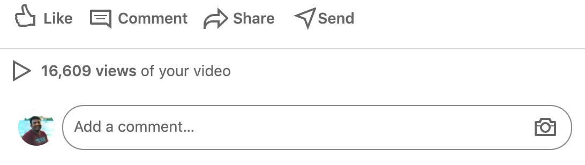
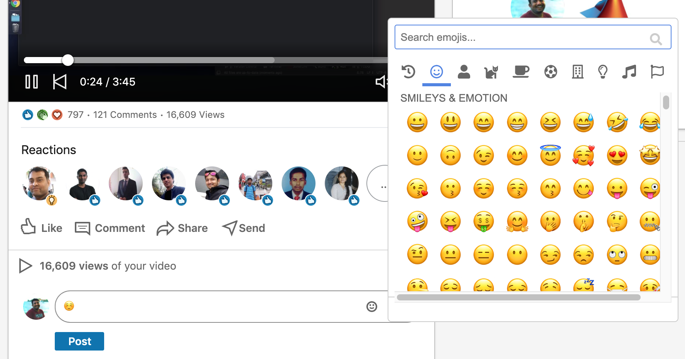

As of `09-July-2020`, LinkedIn web app doesn't provide an ablity to choose emoji's in comment section for all type of posts. 

This extension will automatically add a emoji picker to comment section and user can directly pick the emoji and add it to their comment instead of copy/paste emoji's from other websites.

Refer the below screenshots.

##### Before loading extension:
&nbsp;

&nbsp;&nbsp;
##### After loading extension:
&nbsp;

